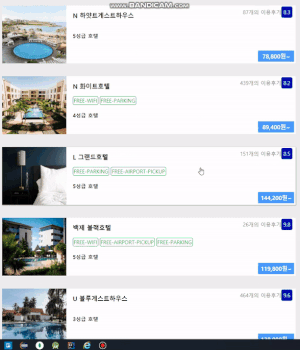
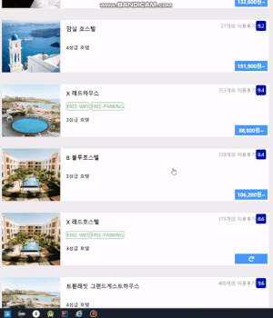

# infinite-scroll & image lazy loading
 React infinite-scroll and lazy loading using Intersection Observer API / Accommocation API used.

## start
- load data from hotel accomodation api
- only load visible images on the screen (lazy load)
- Intersection Obeserver detects each image is about to shown on the screen.
- start to fetch price data after rendering other components.

## load next page
- infinite scroll using Intersection Observer.

## re-load prices 
- reload prices that are failed to fetch in the previous request.

