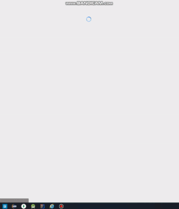

# 인피니트 스크롤(무한 스크롤) & 이미지 지연로딩 
 Intersection Observer API와 숙박 정보 API를 활용한 리액트 무한 스크롤, 이미지 지연 로딩 구현
 
## 시작

- 호텔 숙박 API로 부터 데이터 로딩
- 화면상에 보이는 이미지만 로드함(지연 로딩)
- Intersection Obeserver가 곧 화면상에 보여질 이미지를 미리 로드함
- 다른 정보가 로딩 된 후, 가격 정보가 로딩됨.

## 다음 페이지 로딩
- 화면 스크롤이 바닥에 가까울 경우 다음 페이지를 로딩한다.

## 로딩 실패한 가격 부분은 재로딩 
- API에서 가끔 가격 부분 로딩이 실패한다.
- 실패한 부분은 다시 로딩할 수 있도록한다.

